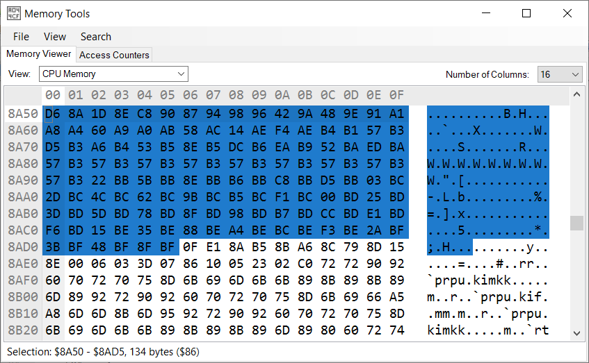

# Capcom 2 Sound Engine Music Ripping Guide
It is the purpose of this guide to show how to rip music from NES games using the Capcom 2 sound engine for subsequent use in the Mega Man 2 Randomizer. While this is a technical process, this guide seeks to explain in sufficient detail that it can be done by someone with knowledge of a few basic coding principles such as hexadecimal numbers and memory addresses.

Note also that this guide looks a lot worse than it actually is. Much of the space is occupied explaining fairly simple things you only need to learn once, and once understood it might take only half an hour to rip an entire game/mod worth of music.

# The Capcom 2 Sound Engine
The Capcom 2 sound engine is the second of the three sound engines used by Capcom in-house developed NES games. After the first engine was used in only two games, the Capcom 2 engine first appeared in Higemaru Makaijima: Nanatsu no Shima Daibouken, and was used most recently in Code Name: Viper, before being replaced in Mega Man 3 and all subsequent games by the Capcom 3 sound engine. It is of course here most notable for its use in Mega Man 1 and 2 and thus the Mega Man 2 Randomizer.

Unlike some other sound engines which use additive time (durations are multiples of some time period, in this case a frame), the Capcom 2 engine uses Western divisive timing (durations are fractions of some time period such as a measure). The engine is known for its very poor support for envelopes, only minimally supporting ASR envelopes by way of fade in and fade out operations. Additionally, it is noteworthy that for a company-standard sound engine none of the Capcom engines support digital DMC audio.

Far more details can be found elsewhere, such as [here](https://www.romhacking.net/documents/785/).

# The Ripping Process
The basic process is as follows, though some steps can be unnecessary e.g. it is unnecessary to find the bank and sound table in a MM1/2 hack because the location of these tables is already known, and must only be performed on a different game whose addresses are not already known.

1. Determine the sound bank
2. Find the sound table
3. Find the tracks to rip
4. Extract the track data
5. Add it to the randomizer
6. Test it out
7. Pass the buck

As an example, we will be ripping the music from the [Vine Man 1.2](https://www.romhacking.net/hacks/4101/) mod of Mega Man 2.

## Determine the Sound Bank
Due to the processor's small 64 KB address space, all but the earliest of NES games (pretty much anything newer than Super Mario Bros 1) uses bank-switching. Bank-switching is a technique where a larger ROM can be mapped to a smaller address space by mapping only a portion of it into that space at a time. This is done by allowing the same range of memory addresses (e.g. $8000-BFFF) to be mapped to different areas of the ROM - called banks - at different times, depending on the instructions issued to the bank-switching hardware. 

All Capcom 2 games I've observed have used the MMC1 bank-switching chip with the configuration that addresses $C000-FFFF make up a fixed bank mapped to the last bank of the ROM while $8000-BFFF are a variable bank mapped to whatever bank contains the code and/or data the game needs at that particular moment. 

We first need to find the bank that contains the audio code and music/SFX data. For Mega Man 2 mods this will be bank $C, but for other games it could be anything. This task is usually trivial. Additionally, when working with addresses in the rest of this guide Mesen must be stopped at an instruction inside the music bank to ensure other addresses we need are loaded. All we need to do is find the first code which accesses the sound hardware and see what bank that code is in.

For this task, like several other steps, we will use the Mesen emulator for its robust debugger.

1. Load the ROM in Mesen. For the sake of illustration we'll be using Vine Man 1.2.
2. Open the debugger with Debug->Debugger
3. Right click on the breakpoints pane and Add
4. Check write only, and do range: $4000-400F and click OK
5. Run the game with F5. If the game does not play intro or title screen music it may be necessary to play the game just enough for it to start playing its first music or SFX track.
6. The game will stop running when one of the sound registers gets written to
7. Record the bank number for the $8000-BFFF bank. We'll need this again later.

The above debugger picture shows 4 things:
1. The current instruction where the breakpoint hit
2. The indicator that the breakpoint was hit (rather than execution breaking for some other reason)
3. The breakpoints pane with breakpoint on audio registers
4. The bank number for the $8000-BFFF bank, confirming it to be $C

## Find the Sound Table
All Capcom 2 games have a table of pointers to the data for the different sounds (music and SFX). The basic process is to go to the BeginTrack function and execute code in it until we get to the code that pulls the pointer out of the sound table.

First of all we need to find the BeginTrack function. This we can locate from information we already have. The basic layout of the sound code is that it starts with a 3-byte JMP instruction to the frame handler function; after this, at offset 3, is the BeginTrack function. But where does the sound code begin? In all cases I've observed it's on a $1000 byte boundary, typically $8000 or $9000. Which we can infer from where the breakpoint landed us in the prior step. As seen in the picture, the breakpoint landed on $8228, so it's a pretty good bet BeginTrack is at $8003. This can be checked in the Mesen debugger by going (CTRL-G) to $8000 and checking if we see something resembling the following picture (which we do).

Click on the first instruction of BeginTrack and create a breakpoint (F9); additionally, turn off the original breakpoint by unchecking it in the breakpoints pane. Now reset the game (Debug->Reset) so we can make sure to get the first sound played. With the debugger open Mesen breaks on the very first instruction after reset - note how there's no breakpoint indicator like before. We don't care about the first instruction, so just run the debugger (F5 from the debugger window).

The next time the game stops should be when it hits the BeginTrack breakpoint. Take a look at the A register under CPU Status. This is the track number the game is requesting be started. If it's a number near $FF this is actually a function code for the sound engine, e.g. "reset sound engine" for $FF. We don't care about these. Just run the game (F5) until it breaks on one with a lower number; e.g. in our example the first track to play will be the intro music, which is track $E.

Now that we're starting a real music track, we need to follow the code down to where it accesses the sound table, which shouldn't be too far. You can see at the top of the BeginTrack function the handler code for the aforementioned function codes. Step through the code line by line with F10 until you get to a place resembling the following picture. This line shows the sound table address, which is $8A50 as expected for a Mega Man 2 mod.

## Find the Tracks to Rip
Now that we have the sound table, finding the data for tracks is as easy as looking up the track number in the table. But before we can look up track numbers in the table, we need to know which track numbers to look up. For this there are two methods.

### Method 1: Play the Game
The first method is to set a breakpoint in BeginTrack and play the game through, recording the track numbers as new tracks are played. However, breaking every time a music track OR sound effect plays would make the game unplayable. Thus we actually want to set the breakpoint further into the function. Looking at the previous image of the debugger, just after the code that loads the pointer from the sound table is code which reads the first byte of the sound data and checks if it's a music track or a sound effect; if it's a a music track the byte will be $0F, while if it's a sound effect it will be $x0. Specifically, in our example, anyway, we want to break at $8044. This will break only when a new music track begins playing.

However, by this point in the code the track number is unavailable. The track data address is still there (at $e2 in little-endian format, for this example), but to get the track number itself we need to go back a few instructions. Fortunately, Mesen is able to step backwards in the debugger (SHIFT-F10). If we backtrack to $802F, the track number will be in register A.

### Method 2: Play the Music
An important fact is that when the game is stopped in the debugger we not only can view the values of variables but can also change them. This means when we breakpoint in BeginTrack we can change the track number to be any of the tracks.

For this all that needs to be done is to breakpoint at the start of BeginTrack and wait for it to be called. Once the breakpoint has been hit, the A register box can be clicked on and rewritten with the track to be played, then run it (F5).

This works best in an area where you can generate sound effects at will (e.g. shoot your gun) but not outside your control (e.g. from enemies). Then it's just a matter of starting at track 0 and working your way up, identifying tracks as they're encountered. Keep in mind that the randomizer requires track names, so make sure to identify where each track is played in the game as you listen to them, unless of course it's a track that you're not going to rip.

## Extract the Track Data

As of right now we have the sound table address and the list of track numbers to rip. Together these are everything we need to extract the track data. Now open the memory viewer (Debug->Memory Tools from the main Mesen window) and go (CTRL-G) to the address of the sound table.

The following image shows the sound table for Vine Man, with a guestimate for the whole table selected (guessed based on the fact that the pointers are all ascending and within the $8000-BFFF range). Each entry in the table is a 2-byte pointer to the start of the music data for that track. Note, however, that the pointers in the table are stored in "little-endian" order; this means that the low byte is stored first in memory, followed by the high byte, e.g. the pointer $ABCD would be stored CD AB.

Find the entry for the track you want. Also look at the next entry in the table to find out how large the track is, which determines how much you need to copy to get the whole track. Note that there is no requirement that the pointers be ascending; it's simply good luck that they are in this case. If they're not ascending you'll have to manually figure out what track immediately follows the track you want to rip in memory, at significantly greater effort.

For the sake of illustration, we'll rip track 0 (Corrupt Man). We can see that the track starts at $8AD6 and is $8E1D - $8Ad6 = $347 bytes long. Now go (CTRL-G again) to the start of the track at $8AD6. In this case the track data is shown in the previous image, starting at $8AD6. 

While not necessary, we can observe a couple elements that all tracks have in common. The first byte of the track data is $0F, which indicates it's a music track; if it were a sound effect this byte would be $x0. This is followed by 5 pointers that fall within the boundaries of the track; these are the pointers to individual channel data (plus one for the instrument table).

Select $8AD6-8E1C and copy (CTRL-C) and we now have the data for the track. Conveniently, Mesen copies in hexadecimal, so we don't need to convert that manually.

Lastly, we need to sanitize the data. Mesen copies data as it appears in the memory viewer, which means that there is a line break every so many bytes. This can be done easily online [here](https://removelinebreaks.net/). Paste the data into the text box and select "None" for "Convert line breaks to" and "Convert paragraphs to" and finally hit Convert. You can then select the output text and copy.
