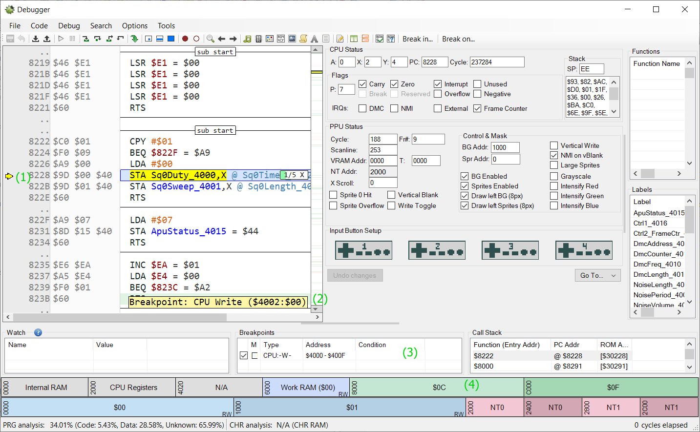
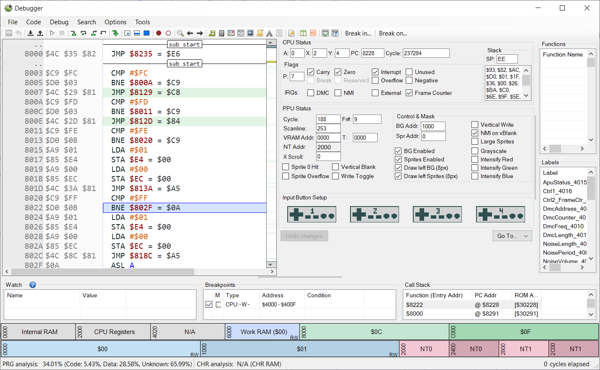
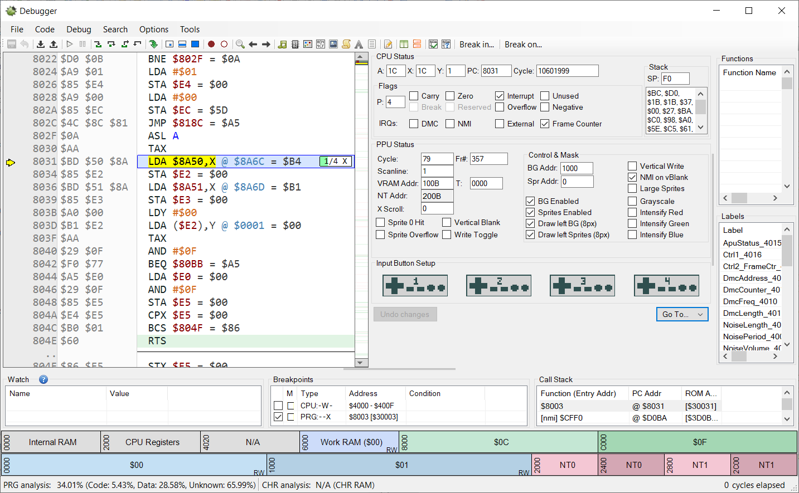

# Capcom 2 Sound Engine Music Ripping Guide
It is the purpose of this guide to show how to rip music from NES games using the Capcom 2 sound engine for subsequent use in the Mega Man 2 Randomizer. While this is a technical process, this guide seeks to explain in sufficient detail that it can be done by someone with knowledge of a few basic coding principles such as hexadecimal numbers and memory addresses.

# The Capcom 2 Sound Engine
The Capcom 2 sound engine is the second of the three sound engines used by Capcom in-house developed NES games. After the first engine was used in only two games, the Capcom 2 engine first appeared in Higemaru Makaijima: Nanatsu no Shima Daibouken, and was used most recently in Code Name: Viper, before being replaced in Mega Man 3 and all subsequent games by the Capcom 3 sound engine. It is of course here most notable for its use in Mega Man 1 and 2 and thus the Mega Man 2 Randomizer.

Unlike some other sound engines which use additive time (durations are multiples of some time period, in this case a frame), the Capcom 2 engine uses Western divisive timing (durations are fractions of some time period such as a measure). The engine is known for its very poor support for envelopes, only minimally supporting ASR envelopes by way of fade in and fade out operations. Additionally, it is noteworthy that for a company-standard sound engine none of the Capcom engines support digital DMC audio.

Far more details can be found elsewhere, such as [here](https://www.romhacking.net/documents/785/).

# The Ripping Process
The basic process is as follows, though some steps can be unnecessary e.g. it is unnecessary to find the bank and sound table in a MM1/2 hack because the location of these tables is already known, and must only be performed on a different game whose addresses are not already known.

1. Determine the sound bank
2. Find the sound table
3. Find the tracks to rip
4. Extract the track data
5. Add it to the randomizer's track list

As an example, we will be ripping the music from the [Vine Man 1.2](https://www.romhacking.net/hacks/4101/) mod of Mega Man 2.

## Determine the Sound Bank
Due to the processor's small 64 KB address space, all but the earliest of NES games (pretty much anything newer than Super Mario Bros 1) uses bank-switching. Bank-switching is a technique where a larger ROM can be mapped to a smaller address space by mapping only a portion of it into that space at a time. This is done by allowing the same range of memory addresses (e.g. $8000-BFFF) to be mapped to different areas of the ROM - called banks - at different times, depending on the instructions issued to the bank-switching hardware. 

All Capcom 2 games I've observed have used the MMC1 bank-switching chip with the configuration that addresses $C000-FFFF make up a fixed bank mapped to the last bank of the ROM while $8000-BFFF are a variable bank mapped to whatever bank contains the code and/or data the game needs at that particular moment. 

We first need to find the bank that contains the audio code and music/SFX data. For Mega Man 2 mods this will be bank $C, but for other games it could be anything. This task is usually trivial. All we need to do is find the first code which accesses the sound hardware and see what bank that code is in.

For this task, like several other steps, we will use the Mesen emulator for its robust debugger.

1. Load the ROM in Mesen. For the sake of illustration we'll be using Vine Man 1.2.
2. Open the debugger with Debug->Debugger
3. Right click on the breakpoints pane and Add
4. Check write only, and do range: $4000-400F and click OK
5. Run the game with F5. If the game does not play intro or title screen music it may be necessary to play the game just enough for it to start playing its first music or SFX track.
6. The game will stop running when one of the sound registers gets written to
7. Record the bank number for the $8000-BFFF bank. We'll need this again later.

The above debugger picture shows 4 things:
1. The current instruction where the breakpoint hit
2. The indicator that the breakpoint was hit (rather than execution breaking for some other reason)
3. The breakpoints pane with breakpoint on audio registers
4. The bank number for the $8000-BFFF bank, confirming it to be $C

## Find the Sound Table
All Capcom 2 games have a table of pointers to the data for the different sounds (music and SFX). The basic process is to go to the BeginTrack function and execute code in it until we get to the code that pulls the pointer out of the sound table.

First of all we need to find the BeginTrack function. This we can locate from information we already have. The basic layout of the sound code is that it starts with a 3-byte JMP instruction to the frame handler function; after this, at offset 3, is the BeginTrack function. But where does the sound code begin? In all cases I've observed it's on a $1000 byte boundary, typically $8000 or $9000. Which we can infer from where the breakpoint landed us in the prior step. As seen in the picture, the breakpoint landed on $8228, so it's a pretty good bet BeginTrack is at $8003. This can be checked in the Mesen debugger by going (CTRL-G) to $8000 and checking if we see something resembling the following picture (which we do).

Click on the first instruction of BeginTrack and create a breakpoint (F9); additionally, turn off the original breakpoint by unchecking it in the breakpoints pane. Now reset the game (Debug->Reset) so we can make sure to get the first sound played. With the debugger open Mesen breaks on the very first instruction after reset - note how there's no breakpoint indicator like before. We don't care about the first instruction, so just run the debugger (F5 from the debugger window).

The next time the game stops should be when it hits the BeginTrack breakpoint. Take a look at the A register under CPU Status. This is the track number the game is requesting be started. If it's a number near $FF this is actually a function code for the sound engine, e.g. "reset sound engine" for $FF. We don't care about these. Just run the game (F5) until it breaks on one with a lower number; e.g. in our example the first track to play will be the intro music, which is track $E.

Now that we're starting a real music track, we need to follow the code down to where it accesses the sound table, which shouldn't be too far. You can see at the top of the BeginTrack function the handler code for the aforementioned function codes. Step through the code line by line with F10 until you get to a place resembling the following picture. This line shows the sound table address, which is $8A50 as expected for a Mega Man 2 mod.

